# Learning Management System: A MEAN Project
This project is based on the MEAN architecture (MongoDB, Express, Angular, and Node) and  involves deploying three services: frontend, backend, and compiler for angular. 

## Architecture

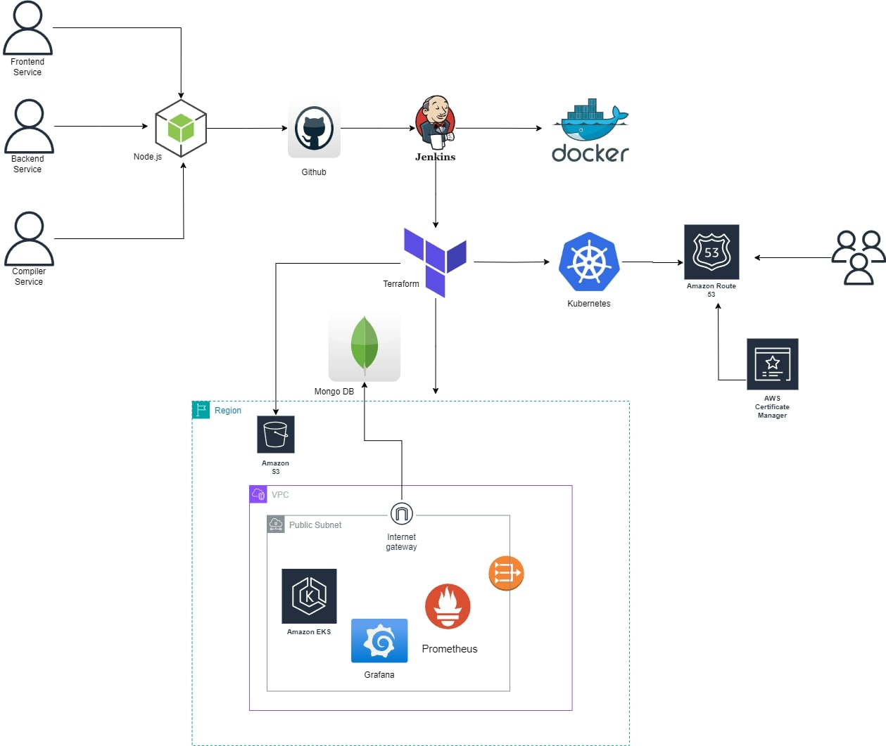

The architecture represents a CI/CD pipeline and deployment environment that utilizes several tools and cloud services to manage, build, deploy, and monitor applications. ensures a seamless development, deployment.Consist of components work together:

1.	Frontend, Backend, and Compiler Services:
These services form the core components of the application, each serving different purposes like user interface, business logic, and code compilation.
2.	Node.js:
Node.js is used as the runtime environment for these services, enabling JavaScript execution on the server side.
3.	GitHub:
Source code is managed and versioned in GitHub. Developers commit and push their changes here.
Jenkins:
Jenkins is a CI/CD tool that pulls the latest code from GitHub, builds it, runs tests, and creates Docker images for deployment.
5 Docker:
Docker is used to containerize the application, ensuring it runs consistently across different environments.

## Managing Resources and Cost Optimization

This architecture is simple, and Costs are much lower than other MEAN stack applications. As we are running the DevOps pipelines locally and using ECR with EKS on EC2, costs are much cheaper than expected.
Here is a breakdown of all the costs as per traffic requirements- 

## Deployment Configuration

The LMS project aims to deploy and scale a MEAN stack application (MongoDB, Express.js, Angular, Node.js) to ensure high availability and cost optimization.

### Key Objectives

1. *CI/CD Pipeline*: Automate build, test, and deployment with Jenkins.
2. *Kubernetes Deployment*: Use Kubernetes for scalable container orchestration.
3. *Monitoring*: Set up Prometheus and Grafana for system monitoring and visualization.

### Tools

- *AWS Services*: Infrastructure management.
- *Jenkins*: CI/CD automation.
- *Kubernetes (K8s)*: Container orchestration.
- *Prometheus*: Metrics collection.
- *Grafana*: Metrics visualization.
- *Terraform*: Infrastructure provisioning.

### Deployment Architecture

- *Frontend*: Angular on port 4200.
- *Backend*: Node.js/Express.js on port 3001.
- *Compiler*: Port 2358.
- *Monitoring*: Prometheus on port 9090, Grafana on port 3000.
- *Extras*: Autoscaling Groups, Public Network, CloudWatch, Cloudflare.

This setup ensures a robust, scalable, and efficient LMS deployment.


The deployment process is automated using Kubernetes, Terraform, and Jenkins. Below are the detailed steps and configurations required for each part of the process.

## Backend Setup

Backend setup uses MongoDB as a NoSQL database store for all the large course data, student data and any other data pertaining to the LMS. This deployment is largely local machine based with pipelines running on the local machine through Jenkins, Docker and Terraform.

Here are the steps -

### Clone the Repository into local system

Install git and clone the repository into the local system. As this is a node application, install node.js and npm 

### Install Dependencies

    command: npm install

This will install all the dependencies to run the backend.

### Configure Environment Variables

- Create a .env file in the root with the following variables:

    - PORT=3001
    - Mongo_URL=mongodb+srv://{username}:{password}@{mongocluster}.mongodb.net/{database}
    - GITHUB_CLIENT_SECRET=clientpassword

We use port 3001 to communicate with the Mongo DB and collect data.

## Need to change some settings in Backend:

 - mvc > controllers > student > courses
    
 - executeCode.js create variable URL and replace post url to this variable

```js
const base_compiler_url = `${process.env.COMPILER_URL}submissions?base64_encoded=true&wait=true`;
```

    - runSampleTestCases.js create variable URL and replace post url to this variable

```js
const base_compiler_url = `${process.env.COMPILER_URL}submissions?base64_encoded=true&wait=true`;
```

    - verifyCode.js create variable URL and replace post url to this variable

```js
const base_compiler_url = `${process.env.COMPILER_URL}submissions?base64_encoded=true&wait=true`;
```

### Run Server

    command: node server.js

- Access the backend on http://localhost:3001.

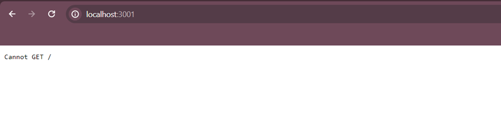

### Docker Setup for Backend

Create a DockerFile to push to ECR. We have a docker file in the repository, and it can be built using the docker commands below-

```Dockerfile

FROM node:18
WORKDIR /app
COPY package.json .
RUN npm install
COPY . .
EXPOSE 3001
CMD ["node", "server.js"]

```

### Build and Push Docker Image

    command: docker build -t lms-backend:latest .
    command: docker tag lms-backend:latest ankuronlyme/capstone_backend:v1
    command: docker push ankuronlyme/capstone_backend:v1

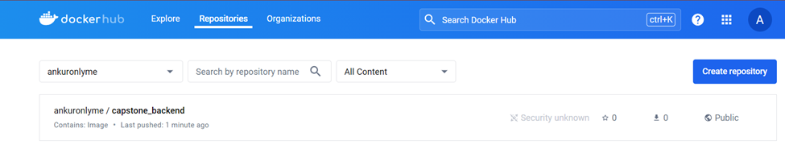


### Run Docker Container

    command: docker run -dp 3001:3001 \-e "PORT=3001" \-e "mongodb+srv://{username}:{password}@{mongocluster}.mongodb.net/{database}" \-e "GITHUB_CLIENT_SECRET=clientpassword" \{dockerhubuid}/capstone_backend:v1

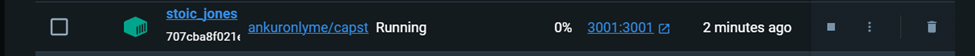


## Frontend Setup

Front end setup is done in a similar way with a Docker Hub image push.

### Clone the Repository into local system

## Install Angular CLI

    command: npm install -g @angular/cli

## Install Dependencies and Start Development Server

    command: npm install --force
             source ./modify_quill_editor.sh
             npm start

## Build Angular Application

    command: ng build --prod

 - Check the build output in the dist directory.

## Docker Setup for Frontend

Build a dockerfile below or use our frontend dockerfile from the repository

```Dockerfile

# Use a Node.js image as the Build Stage
FROM node:18 AS build

# Set the working directory
WORKDIR /app

# Copy package.json and package-lock.json and install dependencies
COPY package*.json ./

# Installation of all dependencies
RUN npm install --force
RUN npm install -g @angular/cli

# Install dos2unix to convert line endings
RUN apt-get update && apt-get install -y dos2unix

# Copy the script into the Docker image
COPY modify_quill_editor.sh .

# Convert line endings to Unix format to remove carriage return characters
RUN dos2unix modify_quill_editor.sh

# Make the script executable
RUN chmod +x modify_quill_editor.sh

# Execute the script
RUN ./modify_quill_editor.sh

# Copy the rest of the application code
COPY . .

# Build the Angular application
RUN npm run build --prod

# Use a lightweight web server to serve the frontend and deployment Process
FROM nginx:alpine

COPY --from=build /app/dist/lms-front-ang /usr/share/nginx/html

# Expose the port on which the frontend will run
EXPOSE 80

# Start the web server
CMD [ "nginx", "-g", "daemon off;" ]

```

    
### Build and Push Docker Image

    command: docker build -t lms-frontend:latest .
             docker tag lms-frontend:latest {dockerhubuid}/capstone_frontend:v1
             docker push {dockerhubuid}/capstone_frontend:v1

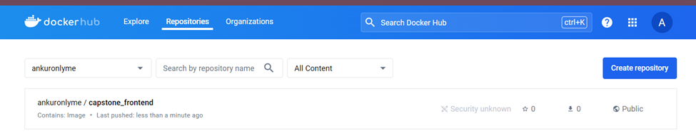

### Run Docker Container

    command: docker run -dp 4200:80 {dockerhubuid}/capstone_frontend:v1

## Compiler Setup

- Installation of Compiler for AngularJS deployment involves building the compiler in a local machine and deploying it via Kubernetes


### Compiler Installation on Local Machine- Part 1
    - wget https://github.com/judge0/judge0/releases/download/v1.13.0/judge0-v1.13.0.zip
    - unzip judge0-v1.13.0.zip
    - cd judge0-v1.13.0
    - sudo docker-compose up -d db redis
    - sleep 10s
    - sudo docker-compose up -d
    - sleep 5s

### Configuring server and nginx with certbot.

    - sudo apt-get update -y
    - curl -fsSL https://download.docker.com/linux/ubuntu/gpg | sudo gpg --dearmor -o /usr/share/keyrings/docker-archive-keyring.gpg
    - echo "deb [arch=amd64 signed-by=/usr/share/keyrings/docker-archive-keyring.gpg] https://download.docker.com/linux/ubuntu $(lsb_release -cs) stable" | sudo tee /etc/apt/sources.list.d/docker.list > /dev/null
    - sudo apt-get install apt-transport-https ca-certificates curl gnupg lsb-release -y
    - sudo apt-get update -y
    - sudo apt-get install docker-ce docker-ce-cli containerd.io -y
    - sudo usermod -aG docker $USER
    - sudo apt-get install docker-compose -y
    - sudo apt-get install nginx -y
    - sudo apt install snapd -y
    - sudo snap install --classic certbot
    - sudo ln -s /snap/bin/certbot /usr/bin/certbot
    - sudo certbot --nginx
    - sudo apt install unzip -y

- Compiler is succesfully setup in the local machine.

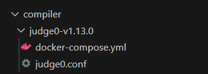'


## Kubernetes Deployment for Backend, Frontend and Compiler

###  Kubernetes Manifests for Compiler:

    - Configmap.yaml
    - storageclass.yaml
    - postgres-secret.yaml
    - postgres-pv.yaml
    - postgres-pvc.yaml
    - judge0-db-deployment.yaml
    - postgres-service.yaml
    - redis-pv.yaml
    - redis-pvc.yaml
    - judge0-redis-deployment.yaml
    - redis-service.yaml
    - compiler_service.yaml
    - judge0-server-deployment.yaml
    - judge0-workers-deployment.yaml


 - Important configuration required in compiler for correct excution:

    - Compiler
        - postgres-secret.yaml file inside 

```yaml
  REDIS_PASSWORD: <YOUR_REDIS_PASSWORD>
  POSTGRES_PASSWORD: <YOUR_POSTGRES_PASSWORD>
```

 - Write Kubernetes Manifests for Backend:

        backend-secret.yaml
        backend_deployment.yaml
        backend_service.yaml

 - Important Configuration required in backend for execution

       - In Backend need to setup secrets
           - backend-secret.yaml file need to add the below credentials

```yaml

    PORT: <YOUR_CONTAINER_PORT_NUMBER>
    JWT_TOKEN_SECRET: <YOUR_JWT_TOKEN>
    AWS_REGION: <YOUR_AWS_REGION>
    AWS_ACCESS_KEY_ID: <YOUR_AWS_ACCESS_KEY_ID>
    AWS_SECRET_ACCESS_KEY: <YOUR_AWS_SECRET_ACCESS_KEY>
    AWS_BUCKET_NAME: <YOUR_AWS_S3_BUCKET_NAME>
    GITHUB_CLIENT_ID: <YOUR_GIT_CLIENT_ID>
    GITHUB_CLIENT_SECRET: <YOUR_GIT_CLIENT_SECRET>

```
   - deployment.yaml file need to add below points
```yaml

    name: MONGO_URL
    value: "mongodb+srv://<USERNAME>:<PASSWORD>@sparrow.hcgs1ob.mongodb.net/<database>"
    name: COMPILER_URL
    value: "YOUR_COMPILER_URL"
```


 - Write Kubernetes Manifests for Frontend:

        frontend_deployment.yaml
        frontend_service.yaml

 - Important Configuration required in frontend for excutation
    - src > app > services > api > constants.ts

```js

export const backendUrl =  'YOUR_BACKEND_URL';
export const frontendUrl = 'YOUR_FRONTEND_URL';

```

## AWS Configuration:

Before we proceed with Terraform and Jenkins, Configure the following items-

- Create an IAM user with admin permissions and download the access keys
- Download AWS CLI and configure the local machine. Use command:  aws configure
- In the IAM console, attach the following policies to certain roles
- eks-cluster-role:
     
      EKSClusterPolicy
      EC2FullAccess

- prometheus-role:

      EC2ReadOnlyAccess
  
- AWSServiceRoleForAmazonEKSNodeGroup:
      Configure the built in role for AmazonEKSNodeGroup
  
<! Insert AWS Screenshots here>

##  Terraform Configuration:

To continue with the Terraform Configuration, Download and install terraform.exe on the local machine. Configure the files main.tf (optional outputs.tf and variables.tf). Here is a breakdown of the main.tf file:

### Main.tf Configuration:

1. *Providers and Terraform Block*: Specifies required providers (random and aws) with versions and Terraform minimum version.
2. *AWS Provider Configuration*: Configures the AWS provider with the specified region (ap-south-1).
3. *Fetch Availability Zones*: Fetches availability zones in the configured region.
4. *Local Variables*: Stores availability zone names fetched from aws_availability_zones data source.
5. *IAM Roles*: Fetches existing IAM roles (eks-cluster-role and eks-node-group-role) for EKS.
6. *IAM Role Policy Attachments*: Attaches required IAM policies (AmazonEKSClusterPolicy, AmazonEKSServicePolicy, AmazonEKSWorkerNodePolicy, AmazonEKS_CNI_Policy, AmazonEC2ContainerRegistryReadOnly) to their respective roles.
7. *VPC and Subnets*:
        •	Creates a VPC (eks-vpc) with CIDR block 10.0.0.0/16.
        •	Creates three public subnets (eks-public-subnet-${count.index}) across different availability zones.
    
8. *Internet Gateway and Route Table*:
        •	Creates an Internet Gateway (eks-gateway) and associates it with the VPC.
        •	Creates a public route table (eks-public-route-table) with a default route to the Internet Gateway.
        •	Associates each public subnet with the public route table.
9. *EKS Cluster*:
        •	Creates an EKS cluster (capstone_cluster) with the specified IAM role (eks-cluster-role) and VPC configuration.
        •	Depends on IAM policy attachments for the cluster role.

10. *EKS Node Group*:
        •	Creates an EKS node group (lms-node-group) within the EKS cluster.
        •	Specifies node group configurations like instance types (t3a.large), disk size, and scaling settings (desired_size, max_size, min_size).
        •	Depends on IAM policy attachments for the node group role.

11. *Prometheus and Grafana*:
        •	Creates a helm/Kubernetes deployment of Grafana and Prometheus.
        •	Prometheus acts as a listener for the files.
        •	Grafana is configured as a dashboard for metrics coming via Prometheus.
    
12. *Outputs*:
        •	Provides outputs for the EKS cluster endpoint (cluster_endpoint) and security group ID (cluster_security_group_id).
        •	Provides outputs for the Grafana and Prometheus ip addresses to connect to the Grafana and Prometheus instance respectively.

### Running Terraform:
Terraform will be run via Jenkins. This is only to test if the terraform configuration is working.

    command: terraform init

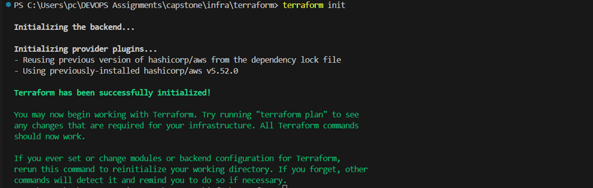


    command: terraform validate

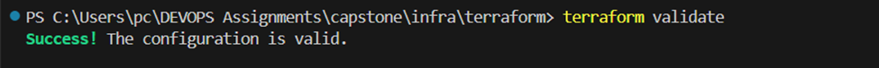


    command: terraform plan

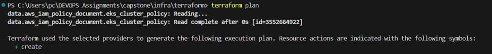


    command: terraform apply

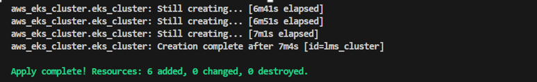

 - We push the terraform tf.state to an S3 bucket 

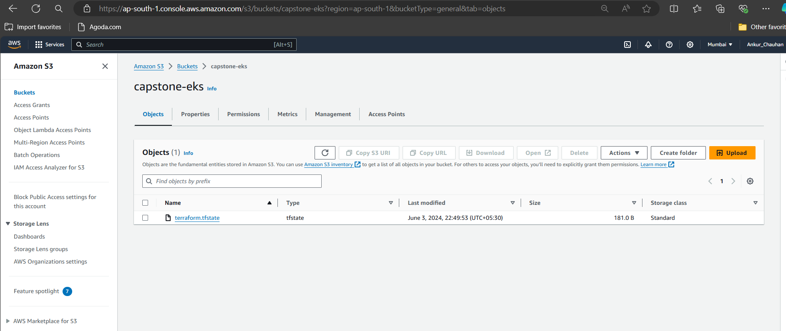   

    command: terraform destroy
    
- After Completion of the Terraform Script, destroy everything

## Jenkins
- We use Jenkins on the local machine.
- Install JAR 11,17 or 21 on the local machine and configure paths
- Run Jenkins as the system and configure Jenkins to use these JAR paths
- Configure Jenkins to access port 8080

### Jenkins Setup
Setup the following Plugins to gain access to all features required to run the jenkinsfile.

- Jenkins > Manage Jenkins > Plugins:
  
     - Docker Pipeline
     - Kubernetes
     - Kubernetes CLI
     - terraform
     - AWS Web Services SDK : ALL
     - AWS credentials
     - Pipeline: AWS

- Setup important credentials and tools to excute our pipeline

   - Jenkins > Manage Jenkins > Credentials:

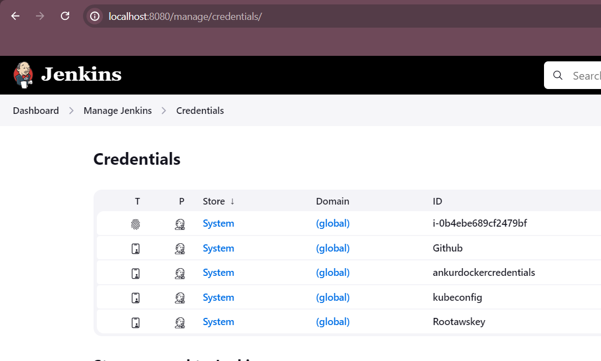


   - Jenkins > Manage Jenkins > Tools:

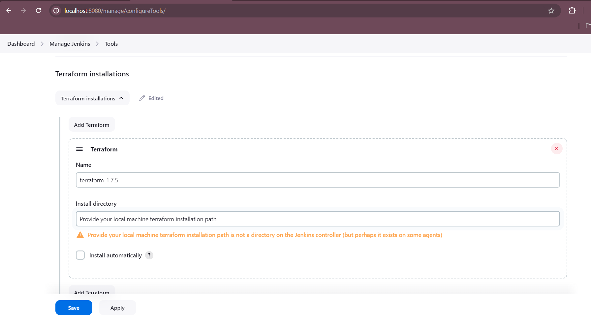

## Jenkins File
- Jenkinsfile to automate the CI/CD process.

- The Jenkinsfile should include the following stages:

     - Declarative: Tool Install
     - Checkout from Git
     - Build Docker Images
     - Verify Terraform Installation
     - Connect to Terraform
     - Configure kubectl
     - Deploy to EKS

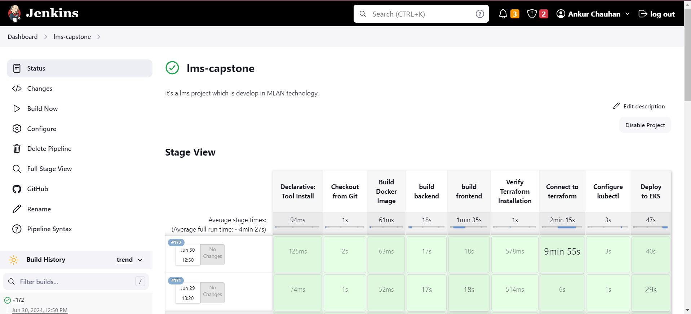

- Our pipeline is running successfully and cluster is created on EKS:

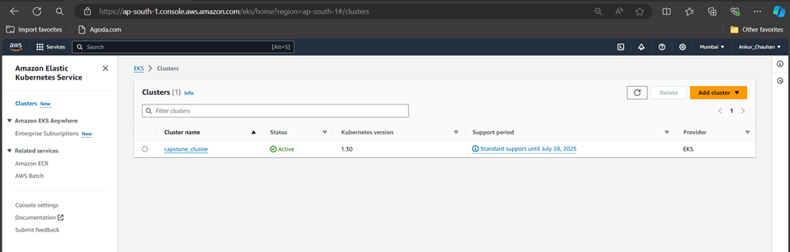

- Confirm our services are working on EKS:

Frontend with load balancer:

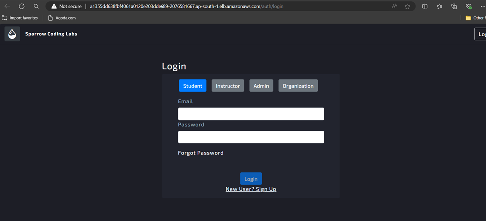

Backend with load balancer:

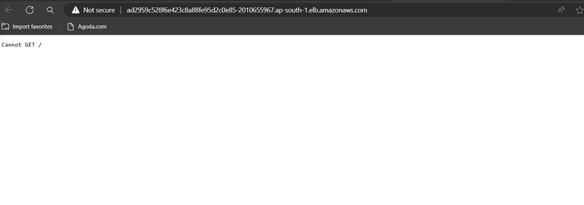

Compiler with Load balancer:


## Domain hosted with Route53

 - Create your Hoasted Zone.

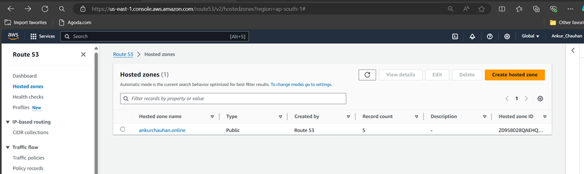 

 - Create records in hoasted zone and then configured the load balancer into records.

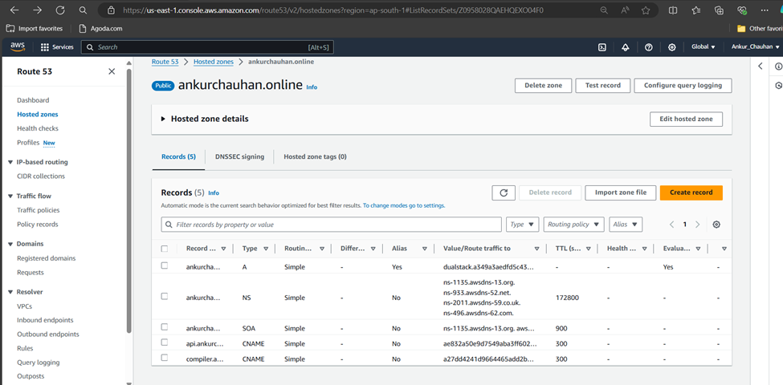


- Confirm our load balancer are working on Route 53:

Frontend with domain:

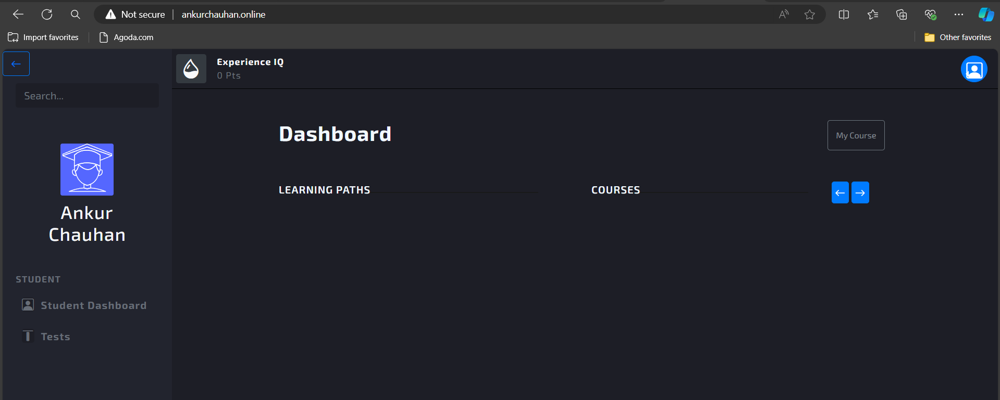


Backend with domain:

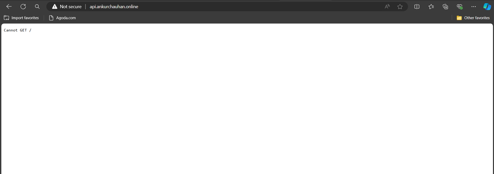


Compiler with domain:

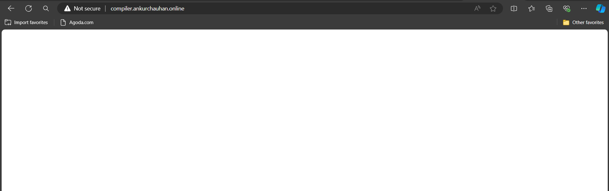


## Monitoring with Prometheus and Grafana

- After the deployment either via Kubernetes or yaml deployments (in our repository), Configure Grafana.
- Use the IP addresses exported via Terraform for Grafana to connect to the instance.
- The default username and password for Grafana is admin / admin. Log into the Grafana application

!< Configure Grafana

- In Grafana select the Data Sources option under Connections.
- Click add a data source and connect Prometheus 
- Add the Prometheus endpoint IP

!< Prometheus Connection

- After it is initialized, click on Dashboards and create a dashboard
- We built a simple dashboard to check EC2 resources. The dashboard export is available in the repository as a .JSON export.

!< Grafana Dashboard


# Conclusion

This brings us to the end of our project hosting a MEAN LMS application. 

## Next Steps

This is a basic outline of how a MEAN three stack application should be hosted. Improvements can include a public docker hub and scripts to run these files along with a Jenkins on Server Approach with a deployment Server being used instead of the local machine in the architecture. 


